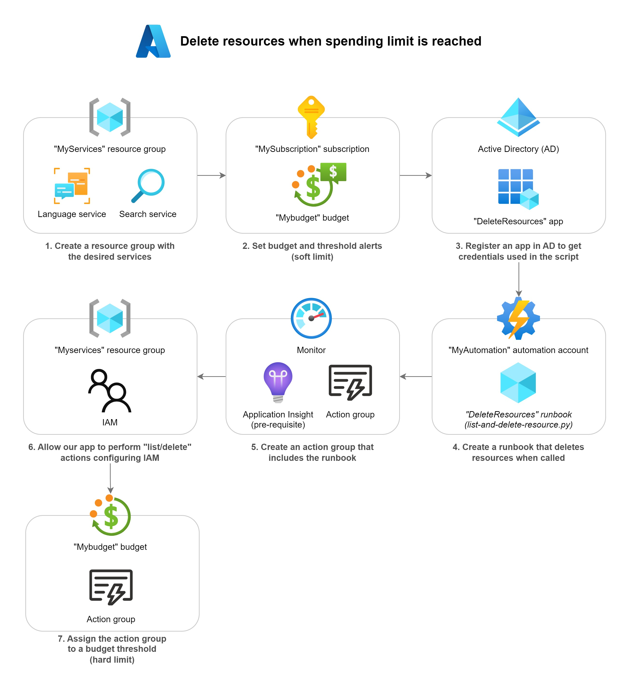

# Azure Spending Limits

Minimal configuration to set soft **and hard** limits on Microsoft Azure to avoid overspending with a "Pay-as-you-go" account.

Some examples of why it's useful :

- Avoid unexpected API consumption spending (such as infinite loops)
- Avoid cost for forgotten VMs or resources

The provided script will delete the services in a resource group with an action group. It won't delete the resource group, which is convenient. Also, this is a last resort solution as it will require you to reconfigure your services after removal.

_This method is probably not the best but is "quick" to setup and just works. You might prefer [rate-limiting](https://techcommunity.microsoft.com/t5/azure-paas-blog/configure-rate-limits-for-different-api-operations-in-azure-api/ba-p/3789108) API calls, or trigger an action group on a [carefully analyzed spending](https://learn.microsoft.com/en-us/answers/questions/931661/how-can-i-find-how-much-per-hour-i-am-being-billed) (spoiler: this is hard)._

## How to set soft and hard limits

Remember that accumulated cost showing in your "Cost Management" console is an estimate only. Real cost may [take time to update](https://learn.microsoft.com/en-us/azure/azure-monitor/usage-estimated-costs) and is generally stabilized one day after a resource is consumed. However, it is possible to set hard limits based on [forecasted cost](https://learn.microsoft.com/en-us/azure/cost-management-billing/finops/capabilities-forecasting).

This schema represents the steps to set soft and hard limits on a resource group :

1. Group resources into a group that can be controlled for expenses.

    Click on the browsing bar and search for the **Resource Group** page.

    Click on your subscription.

    Note down the **Subscription ID** as SUBSCRIPTION_ID.

    Create a **Resource Group** "MyServices".

    Add any resource you want inside (VM, API services...). These are the resources that will be limited through our budget.

2. Create a budget and set a soft limit (alert).

    Go to the **Subscription** page of the Azure portal and select **Budgets** on the left pane.

    At top of the page, click the **Add** button.

    Configure the budget :

    - **Name** it _MyBudget_ with a _monthly_ **reset period** and set the **Amount** to the hard limit you're willing to spend.
    - Click **Next**.
    - Create two **Alert conditions** :
      1. Type _Actual_ to 80% of budget
      2. Type _Actual_ to 100% of budget
      3. Type _Forecast_ to 110% of budget (reminder : the actual cost is not the real-time one)
    - Add your email address as **Alert recipients**
    - Click **Create**.

    You now have set your soft limit. It will e-mail you when reaching these thresholds.

3. Configure an "App" in Active Directory to retrieve credentials to be used in our runbook.

    Click on the browsing bar and search for the **Azure Active Directory** page.

    On the left pane, click **App registrations**.

    At top of the page, click the **New registration** button.

    Configure the app registration :

    - **Name** it _DeleteResources_.
    - In the **Supported account types** menu, select _Accounts in this organizational directory only (Répertoire par défaut only - Single tenant)_.
    - Click **Register**.

    Let's now generate an app secret and retrieve TENANT_ID, CLIENT_ID and CLIENT_SECRET values for the [`list-and-delete-resource.py`](./list-and-delete-resource.py) script.

    Enter your _DeleteResources_ app configuration from the **App registrations** page.

    On the left pane, click **Certificates & secrets**.

    Click **New client secret** and create one with the default expiration date (recommended). You need to make sure this secret is up-to-date in the later-to-be-created runbook.

    Note down the CLIENT_SECRET value.

    On the left pane, click **Overview**.

    Note down the **Object ID** as CLIENT_ID and **Directory (tenant) ID** as TENANT_ID.

4. Create the runbook that will delete resources when budget is exceeded.

    Click on the browsing bar and search for the **Automation Accounts** page.

    At top of the page, click the **Create** button.

    Configure the automation account :

    - Attribute our previously-created **Resource group** _MyServices_.
    - **Name** it _MyAutomation_ and click **Next**.
    - In the **Advanced** tab, select _System assigned_.
    - In the **Networking** tab, select _Public access_.
    - Click the **Review + Create** button

    In your _MyAutomation_ **Automation Accounts**, click **Runbooks** in the left pane.

    At top of the page, click the **Create a runbook** button.

    Configure the runbook :

    - **Name** it _DeleteResources_.
    - Select **Runbook type** _Python_.
    - Select **Runtime version** _3.8_.
    - Click **Create**.

    Copy/paste the content of the [`list-and-delete-resource.py`](./list-and-delete-resource.py) file. 
    
    Replace the content of the TENANT_ID, CLIENT_ID, CLIENT_SECRET, SUBSCRIPTION_ID and RESOURCE_GROUP variables.

    Click **Save**, then **Publish**.

5. Create an action group that can then be triggered when a spending threshold is reached.

    Click on the browsing bar and search for the **Monitor** page.

    In the left pane, click **Applications**.

    At top of the page, click the **Create** button.

    Configure the "application insights" :

    - Attribute our previously-created **Resource group** _MyServices_.
    - **Name** it _MyAppInsight_.
    - Set **Resource Mode** _Classic_.
    - Click **Review + Create**.

    Go back to the **Monitor** page.

    On the left pane, click **Alerts**.

    At top of the page, click the **Create** > **Action group** button.

    Configure the "application insights" :

    - Attribute our previously-created **Resource group** _MyServices_.
    - Set **Action group name** to _DeleteResources_.
    - Set **Display name** to _DeleteResources_ and click **Next**.
    - In the **Notifications** tab, select **Notification type** _Email/SMS message/Push/Voice_.
        - In the drawer that opened, select _Email_ and enter your email adress.
        - Click **OK**.
    - Click **Next**.
    - In the **Actions** tab, select **Automation Runbook**.
        - In the drawer that opened, set **Run runbook** to _Enabled_.
        - Set **Runbook source** to _User_.
        - Select your subscription.
        - Select **Automation account** _MyAutomation_.
        - Select **Runbook** _DeleteResources_.
        - Click **OK**.
    - Click **Review + Create**.

6. Allow the app the list/delete resources in our resource group

    Click on the browsing bar and search for the **Resource groups** page.

    Select the resource group _MyServices_.

    On the left pane, click **Access control (IAM)**

    At top of the page, click the **Add** > **Add role assignment** button.

    Configure the role assignment :

    - In the **Role** tab, click the **Privileged administrator roles** sub-tab.
    - Select (click) **Contributor**.
    - Select **Assign access to** _User, group or service principal_.
        - In the drawer that opened, type _DeleteResources_ in the **Select** textbox.
        - Click on _DeleteResources_.
        - Click **Select**.
    - Click **Review + assign**.

    :information_source: The **Contributor** role is broad. You might want to [create a custom role](https://learn.microsoft.com/en-us/azure/role-based-access-control/custom-roles) to attribute specific permissions (list/delete) to specific services (i.e: Cognitive Services, Search, VMs).

7. Assign the action group to a budget threshold

    Go to the **Subscription** page of the Azure portal and select **Budgets** on the left pane.

    Select your _MyBudget_ budget.

    At top of the page, click the **Edit budget** button.

    Select the **Set alerts** tab.

    In our previously-created **Alert conditions** of type _Actual_ and threshold _100%_, set **Action group** _DeleteServices_.

    Click **Save**.

You are now safe!
